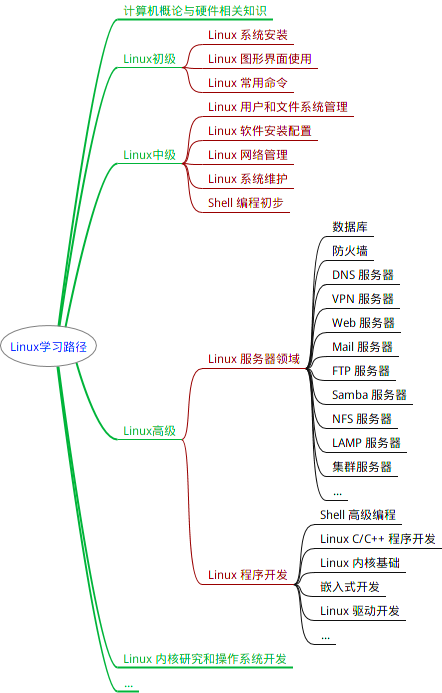

#### 图形界面


#### 终端模拟器

终端这个概念有历史原因，所以才有了终端模拟器这个说法，跟 Shell 不是同一个概念。

下面是几个比较常见的终端模拟器： gnome-terminal，Konsole，xterm，rxvt，kvt，nxterm 和 eterm 。

终端本质上是对应着 Linux 上的 `/dev/tty` 设备，Linux 的多用户登录就是通过不同的 `/dev/tty` 设备完成的，Linux 默认提供了 6 个纯命令行界面的 “terminal”（准确的说这里应该是 6 个 virtual consoles）来让用户登录。在物理机系统上你可以通过使用`[Ctrl]`+`[Alt]`+`[F1]～[F6]`进行切换，不过在我们的在线实验环境中可能无法切换，因为特殊功能按键会被你的主机系统劫持。当你切换到其中一个终端后想要切换回图形界面，你可以按下`[Ctrl]`+`[Alt]`+`[F7]`来完成。

#### Shell 

这里的核就是指 UNIX/Linux 内核，Shell 是指“提供给使用者使用界面”的软件（命令解析器），类似于 DOS 下的 command（命令行）和后来的 cmd.exe 。

普通意义上的 Shell 就是可以接受用户输入命令的程序。它之所以被称作 Shell 是因为它隐藏了操作系统底层的细节。在 UNIX/Linux 中比较流行的常见的 Shell 有 bash、zsh、ksh、csh 等等。

##### 重要快捷键

- <kbd>Tab</kbd> 补全
- <kbd>Ctrl</kbd> + <kbd>C</kbd> 结束当前指令
- <kbd>Ctrl</kbd> + <kbd>D</kbd> 键盘输入结束或退出终端
- <kbd>Ctrl</kbd> + <kbd>S</kbd> 暂停当前程序，暂停后按下任意键恢复运行
- <kbd>Ctrl</kbd> + <kbd>Z</kbd>  将当前程序放到后台运行，恢复到前台为命令`fg`
- <kbd>Ctrl</kbd> + <kbd>A</kbd> 将光标移至输入行头，相当于`Home`键
- <kbd>Ctrl</kbd> + <kbd>E</kbd> 将光标移至输入行末，相当于`End`键
- <kbd>Ctrl</kbd> + <kbd>K</kbd> 删除从光标所在位置到行末
- <kbd>Alt</kbd> + <kbd>Backspace</kbd> 向前删除一个单词
- <kbd>Shift</kbd> + <kbd>PgUp</kbd> 向下翻页。但一般建议 SSH 客户端
- <kbd>Shift</kbd> + <kbd>PgDn</kbd> 向上翻页。
- <kbd>↑</kbd> 之前输过的命令

##### 通配符

Shell 常用通配符：

| 字符                    | 含义                                       |
| ----------------------- | ------------------------------------------ |
| `*`                     | 匹配 0 或多个字符                          |
| `?`                     | 匹配任意一个字符                           |
| `[list]`                | 匹配 list 中的任意单一字符                 |
| `[^list]`               | 匹配 除 list 中的任意单一字符以外的字符    |
| `[c1-c2]`               | 匹配 c1-c2 中的任意单一字符 如：[0-9][a-z] |
| `{string1,string2,...}` | 匹配 string1 或 string2 (或更多)其一字符串 |
| `{c1..c2}`              | 匹配 c1-c2 中全部字符 如{1..10}            |

##### 学会在命令行中获取帮助

在 Linux 环境中，如果你遇到困难，可以使用`man`命令，它是`Manual pages`的缩写。

```
man <command_name>
```

为了便于查找，man 手册被进行了分册（分区段）处理，在 Research UNIX、BSD、OS X 和 Linux 中，手册通常被分为 8 个区段，安排如下：

| 区段 | 说明                                      |
| ---- | ----------------------------------------- |
| 1    | 一般命令                                  |
| 2    | 系统调用                                  |
| 3    | 库函数，涵盖了 C 标准函数库               |
| 4    | 特殊文件（通常是/dev 中的设备）和驱动程序 |
| 5    | 文件格式和约定                            |
| 6    | 游戏和屏保                                |
| 7    | 杂项                                      |
| 8    | 系统管理命令和守护进程                    |

要查看相应区段的内容，就在 man 后面加上相应区段的数字即可，如

```
man 2 ls
```

通常结构是

- **NAME（名称）** 该命令或函数的名称，接着是一行简介。

- **SYNOPSIS（概要）**对于命令，正式的描述它如何运行，以及需要什么样的命令行参数。对于函数，介绍函数所需的参数，以及哪个头文件包含该函数的定义。
- **DESCRIPTION（说明）** 命令或函数功能的文本描述。
- **EXAMPLES（示例）** 常用的一些示例。
- **SEE ALSO（参见）** 相关命令或函数的列表。

通常 man 手册中的内容很多，你可能不太容易找到你想要的结果，不过幸运的是你可以在 man 中使用搜索`/<你要搜索的关键字>`，查找完毕后你可以使用`n`键切换到下一个关键字所在处，`shift+n`为上一个关键字所在处。

使用`Space`（空格键）翻页，`Enter`（回车键）向下滚动一行，或者使用`k`，`j`（vim 编辑器的移动键）进行向前向后滚动一行。按下`h`键为显示使用帮助（因为 man 使用 less 作为阅读器，实为`less`工具的帮助），按下`q`退出。

想要获得更详细的帮助，你还可以使用`info`命令，不过通常使用`man`就足够了。如果你知道某个命令的作用，只是想快速查看一些它的某个具体参数的作用，那么你可以使用`--help`参数，大部分命令都会带有这个参数，如：

```
clang --help
```

